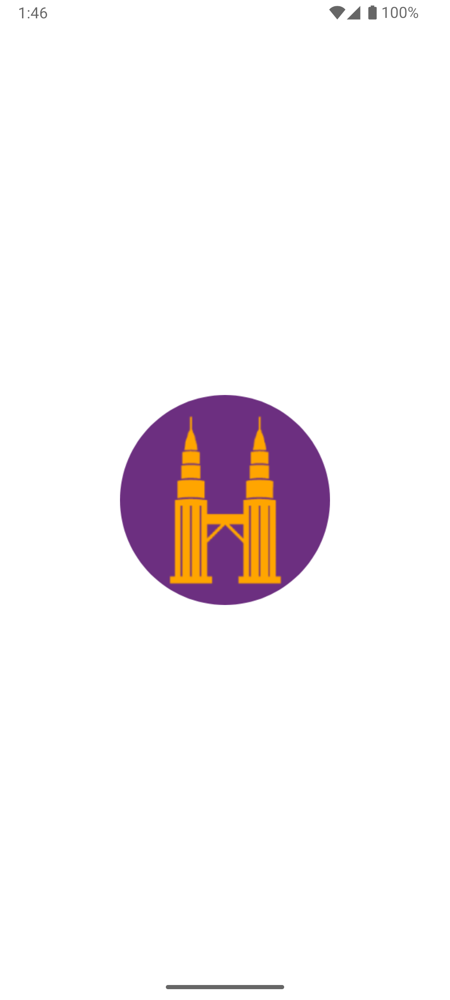
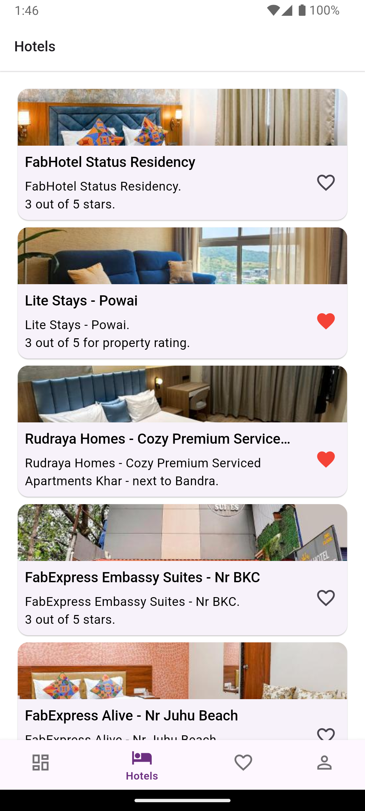
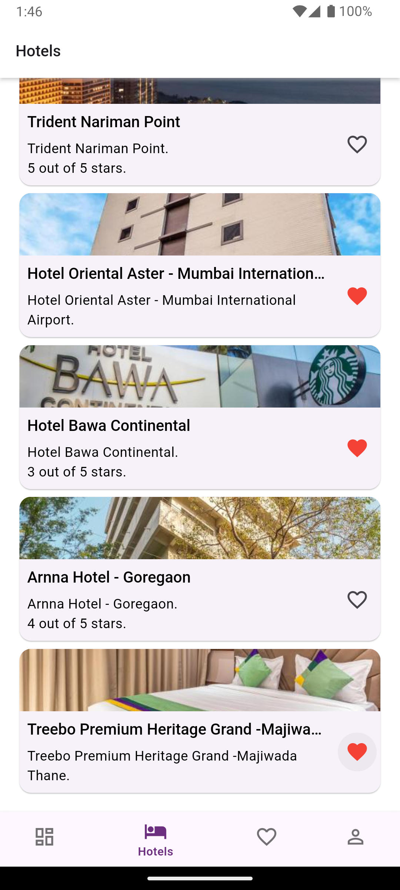
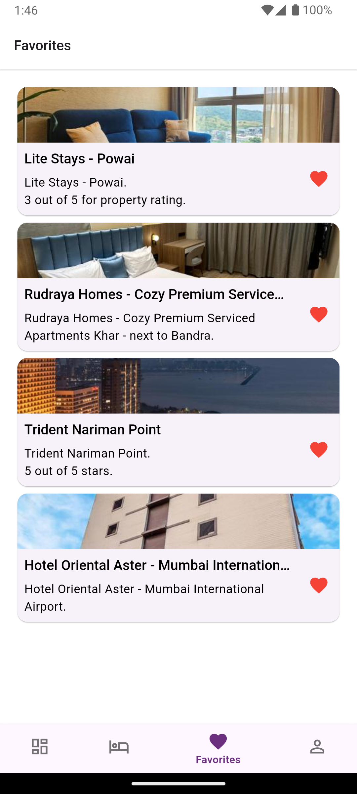
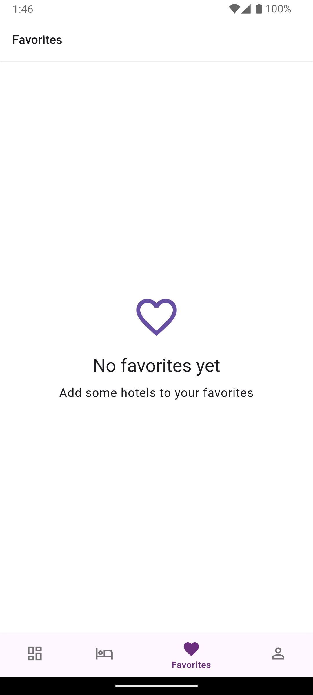

# Hotel Booking App

A Flutter application for hotel bookings with clean architecture and BLoC pattern.

## Features

- Bottom Navigation with 4 tabs (Overview, Hotels, Favourites, Account)
- Hotel listing with search functionality
- Favorite hotels management
- Clean and intuitive UI
- Offline support for favorite hotels
- Error handling with retry mechanism

## Tech Stack

- Flutter
- BLoC for state management
- Auto Route for navigation
- Hive for local storage
- Dio for API calls

## Getting Started

### Prerequisites

- Flutter SDK (latest version)
- Dart SDK (latest version)
- Android Studio / VS Code
- iOS Simulator / Android Emulator

### Installation

1. Clone the repository:
```bash
git clone [repository-url]
```

2. Navigate to project directory:
```bash
cd hotel_booking
```

3. Clean build directory:
```bash
flutter clean
```

4. Install dependencies:
```bash
flutter pub get
```

5. Run build runner:
```bash
dart run build_runner build --delete-conflicting-outputs
```

6. Run app:
```bash
flutter run
```


## Project Structure

```
lib/
├── core/           # App-wide constants, utilities, and configurations
├── data/           # Data layer
│   ├── datasources/    # Remote and local data sources
│   ├── models/         # Data models
│   └── repositories/   # Repository implementations
├── domain/        # Business logic layer
│   ├── entities/      # Business objects
│   ├── repositories/  # Repository interfaces
│   └── usecases/     # Use cases
└── presentation/  # UI layer
    ├── bloc/         # BLoC state management
    ├── pages/        # Screen widgets
    └── widgets/      # Reusable widgets
di.dart                # Dependency injection
main.dart              # Entry point
```

## Architecture

This project follows Clean Architecture principles with three main layers:
- Presentation Layer (UI)
- Domain Layer (Business Logic)
- Data Layer (Data Access)

## Screenshots

<table>
  <tr>
    <td></td>
    <td></td>
    <td></td>
    <td></td>
    <td></td>
  </tr>
  <tr>
    <td align="center">Overview Screen</td>
    <td align="center">Hotel Listing</td>
    <td align="center">Hotel Listing</td>
    <td align="center">Favorites</td>
    <td align="center">Favorites Empty</td>
  </tr>
</table>

## Testing

Run tests using:
```bash
flutter test
```

## Contributing

1. Fork the Project
2. Create your Feature Branch
3. Commit your Changes
4. Push to the Branch
5. Open a Pull Request
